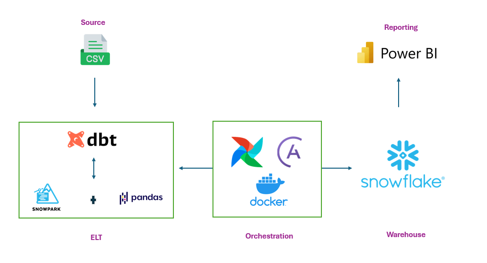
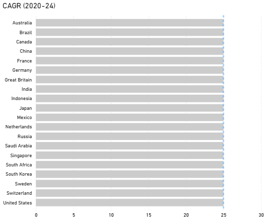
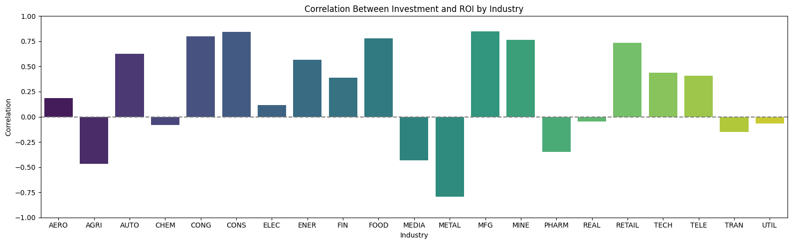

# AI Adoption Analysis Project

This dbt project focuses on analyzing AI adoption data across various countries from 2020-2024, utilizing dbt with Python for comprehensive data transformations and analysis.

## 🎯 Project Overview

This project analyzes AI adoption trends over the past 5 years across multiple countries using an automated data pipeline. The analysis reveals insights into AI investment patterns, adoption rates, and returns on investment in the artificial intelligence sector.

## 🏗️ Architecture

The project implements a modern data stack with the following components:

### 1. **Data Sources**
- **CSV Files**: Real-world AI adoption data stored as dbt seeds
  - `seeds/raw_ai_adoption_data.csv` - Core AI adoption metrics
  - `seeds/raw_countries.csv` - Country dimension data
  - `seeds/raw_industries.csv` - Industry classification data

### 2. **ELT Pipeline**
- **dbt Core**: Primary tool for Extract, Load, and Transform operations
- **dbt Snowflake**: Warehouse-specific adapter for Snowflake integration
- **Python Transformations**:
  - `intermediate/inter_cagr.py` - CAGR calculations using Snowpark
  - `intermediate/inter_roi.py` - ROI analysis using Pandas

### 3. **Orchestration**
- **Apache Airflow**: Workflow scheduling and management
- **Astronomer**: Airflow deployment platform
- **Docker**: Containerized environment for consistent deployments
- *Reference*: [Helpful YouTube Tutorial](https://www.youtube.com/watch?v=OLXkGB7krGo)

### 4. **Data Warehouse**
- **Snowflake**: Cloud data warehouse for scalable data storage and processing

### 5. **Visualization & Reporting**
- **Power BI**: Primary business intelligence tool for dashboards
- **Pandas Charts**: Python-based visualizations for detailed analysis



## 📊 Data Modeling

The project follows a dimensional modeling approach with:

### Fact Table
- **AI Adoption Metrics**:
  - Country adoption rate (%)
  - AI investment (USD MM)
  - Company investment (USD MM)
  - Company return (USD MM)
  - ROI (%)
  - CAGR (%)

### Dimension Tables
- **Countries**: Geographic dimension with country-specific attributes
- **Industries**: Industry classification and sector information

## 📈 Key Findings

### Investment Growth
- **25% Average Increase**: Countries are increasing their AI investment by an average of 25% annually from 2020-2024

### Positive Correlations
Strong positive correlations identified between:
- AI investment and AI returns
- AI investment and adoption rates
- AI investment and ROI across all analyzed countries

## 🚀 Getting Started

### Prerequisites
- dbt Core installed
- Snowflake account and credentials
- Apache Airflow (via Astronomer)
- Docker
- Power BI Desktop (for visualizations)

### Setup Instructions

1. **Clone the repository**
   ```bash
   git clone <repository-url>
   cd ai-adoption-analysis
   ```

2. **Configure dbt profiles**
   ```bash
   dbt profiles.yml
   # Add your Snowflake credentials
   ```

3. **Install dependencies**
   ```bash
   dbt deps
   ```

4. **Load seed data**
   ```bash
   dbt seed
   ```

5. **Run transformations**
   ```bash
   dbt run
   ```

6. **Test data quality**
   ```bash
   dbt test
   ```

## 🔍 Analysis Methodology

1. **Data Extraction**: Raw CSV data loaded via dbt seeds
2. **Data Transformation**: Python-based transformations using Snowpark and Pandas
3. **Metric Calculation**: CAGR and ROI calculations for trend analysis
4. **Visualization**: Multi-tool approach using Power BI and Python charts

## 📊 Supporting Visualizations

Supporting visualizations:

>1. CAGR for all countries from 2020-24 showing as average of 25%



>2. Top 6 industries investment vs return showing positive relation


>3. Correlation between AI investment and adoption rate showing positive


>4. Correlation between AI investment and ROI by different industries also positive



## 📞 Contact

For questions or collaboration opportunities, please reach out via msariga7@gmail.com.

---

*This project demonstrates the power of modern data engineering tools in analyzing AI adoption trends and providing actionable business insights.*